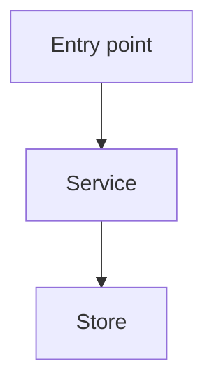

# Codebase Map

## Purpose

Create a lightweight, evidence-backed map of a repo or subsystem before planning, refactoring, reviewing, or handing work to another agent.

This is inspired by knowledge-graph workflows: identify nodes, edges, entry points, flows, and risk boundaries. Keep it offline and Markdown-first. Do not require a graph database, LLM service, package install, browser, or network call.

## When To Use

- Starting work in an unfamiliar repo or large module.
- User asks to understand architecture, flows, dependencies, or impact.
- A refactor touches multiple components.
- Planning agent handoff or parallel workstreams.
- Reviewing whether a change may break downstream behavior.
- Before `plan-work` when the implementation surface is unclear.
- Before `debug-root-cause` only if the system boundaries are unknown; then switch to debugging.

## When Not To Use

- Tiny obvious edits with one file and one verification command.
- Active bug investigation with a clear reproduction path: use `debug-root-cause`.
- Storing durable knowledge after the map is complete: use `capture-learning` for reusable docs.
- General docs review: use `docs-review`.
- Dependency-only changes: use `dependency-work`.

## Hard Rules

- Evidence first: every important node/edge must cite files, symbols, commands, docs, or tests.
- Do not infer architecture from filenames alone; verify entry points and call/reference paths.
- Keep maps scoped. Map the smallest repo area that answers the question.
- Prefer static inspection and repo-local commands. Do not require network access or package installs.
- Do not expose or store secrets. If configs contain secrets, report only the variable names/patterns.
- Do not edit implementation while mapping unless the user explicitly asked for docs-only output.
- If the map will guide code changes, include verification commands and risk boundaries.

## Workflow

1. Define map scope.
   - Whole repo, package, feature, API route, CLI command, workflow, or module.
   - State the user question the map must answer.

2. Inventory top-level structure.
   - README/docs.
   - Package manifests and build/test config.
   - Source roots.
   - Entry points.
   - Tests and fixtures.
   - Deployment/config files.

3. Build node list.
   - Components, modules, services, CLIs, routes, jobs, skills, data stores, external integrations.
   - For each node, capture purpose and evidence path.

4. Build edge list.
   - Imports/calls.
   - API/client boundaries.
   - Data flow.
   - Config/env flow.
   - File/artifact flow.
   - Runtime/deployment flow.

5. Trace key flows.
   - Startup path.
   - Main user action path.
   - Error path.
   - Persistence/artifact path when relevant.
   - Auth/security path when relevant.

6. Assess impact and risks.
   - Direct and indirect callers.
   - Shared state and side effects.
   - Tests covering the area.
   - Missing tests or unclear ownership.
   - Security/privacy concerns.
   - Operational assumptions.

7. Produce a map artifact when useful.
   - Prefer `docs/ai/implementation/map-<scope>.md` for durable project-local maps.
   - For temporary analysis, answer inline and do not create files.
   - Use Mermaid only when it clarifies the flow.

8. Route next action.
   - If implementing: continue with `plan-work`, `tdd-work`, or `execute-work`.
   - If debugging: continue with `debug-root-cause`.
   - If preserving reusable knowledge: continue with `capture-learning`.
   - If coordinating agents: continue with `orchestrate-agents`.

## Output Template

```markdown
## Codebase Map

Scope: ...
Question answered: ...

### Nodes
- `<node>` — purpose. Evidence: `<path[:symbol]>`

### Edges / Flows
- `<source>` -> `<target>` — why/how. Evidence: ...

### Key Entry Points
- ...

### Impact Notes
- Direct impact: ...
- Indirect impact: ...
- Tests/verification: ...
- Risks/gaps: ...

### Recommended Next Step
- Use `<skill>` because ...
```

## Optional Durable Map Template

```markdown
# <Scope> Codebase Map

Last verified: YYYY-MM-DD
Question: ...
Evidence commands:
- `...`

## Component Graph



## Nodes

| Node | Role | Evidence |
|---|---|---|
| ... | ... | ... |

## Flows

### Startup
...

### Main User Flow
...

### Persistence / Artifacts
...

## Boundaries And Risks
...

## Verification Commands
...
```

## Evaluation Notes

- Trigger test: "Map this repo before refactoring auth" should invoke `codebase-map`.
- Negative trigger test: "This test fails, fix it" should invoke `debug-root-cause`, not mapping first unless boundaries are unknown.
- Workflow test: A fresh agent can identify nodes, edges, entry points, and verification commands from repo evidence.
- Failure-mode test: The skill rejects speculation and avoids reading secrets or doing package installs by default.
- Output test: The map includes scope, nodes, edges/flows, evidence, impact notes, and next skill.

## Red Flags

| Rationalization | Why It Is Wrong | Do Instead |
|---|---|---|
| "The folder names explain it" | Names lie or become stale | Verify with entry points, imports, and tests |
| "Map everything" | Huge maps become unusable | Scope to the current question |
| "No tests mentioned, so none exist" | Tests may be elsewhere | Search manifests, CI, and test directories |
| "Architecture doc says X" | Docs drift | Cross-check source evidence |
| "Let's refactor while mapping" | Mixing phases hides risk | Finish map, then choose the next skill |
