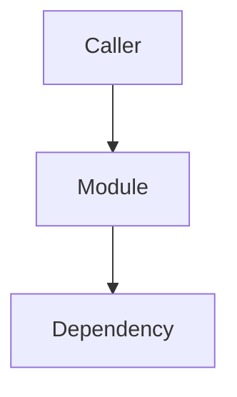

# Project Knowledge

## Purpose

Give the project a durable, local knowledge base that future agents can read before planning, debugging, reviewing, or refactoring.

This borrows the useful idea from Understand-Anything — turn a codebase into navigable knowledge — but keeps dev-kit offline-first and Markdown-first. No graph database, embedding service, web app, or network access is required.

## When To Use

- User asks to initialize or manage project knowledge.
- Starting work in a repo where future agents should share architecture context.
- A `codebase-map` result should become reusable project knowledge.
- `debug-root-cause` found a verified failure pattern worth preserving.
- `plan-work`, `review-work`, or `orchestrate-agents` needs a quick project context pack.
- Before a large refactor when existing `docs/ai/knowledge/` is missing or stale.

## When Not To Use

- One-off task progress or transcript handoff: use `context-handoff`.
- Unverified guesses, brainstorms, or raw logs.
- Public docs polish: use `docs-review`.
- Tiny edits where knowledge storage would add noise.
- Secrets, credentials, customer data, private data, or production dumps.

## Hard Rules

- Store only verified, reusable knowledge.
- Cite evidence for every meaningful claim: file path, symbol, command, test, or user instruction.
- Keep the knowledge base repo-local under `docs/ai/knowledge/`.
- Do not require network calls, package managers, databases, or long-running services.
- Do not store raw secrets. For configs, document variable names and purpose only.
- Update indexes when adding or changing knowledge docs.
- Mark stale or unverified areas explicitly instead of pretending coverage is complete.

## Knowledge Layout

Use these files by default:

```text
docs/ai/knowledge/
  index.md                 # map of all knowledge docs and freshness
  architecture.md          # high-level component graph and entry points
  flows.md                 # important user/data/runtime flows
  decisions.md             # durable technical decisions
  conventions.md           # coding, testing, naming, repo conventions
  failure-patterns.md      # verified bugs/root causes/prevention notes
  modules/
    <module-name>.md       # scoped module maps
```

If the project already has an equivalent folder, adapt to it and document the convention in `index.md`.

## Workflow: Initialize Knowledge Base

1. Create `docs/ai/knowledge/` and `docs/ai/knowledge/modules/`.
2. Inspect README, package manifests, CI, source roots, tests, and config examples.
3. Create or update `index.md` with:
   - last verified date;
   - repo purpose;
   - knowledge coverage table;
   - quick links;
   - recommended read order for agents.
4. Create starter docs only when evidence exists. Leave unknown sections as `Unknown / not mapped yet`.
5. End with verification commands used and recommended next skill.

## Workflow: Query Before Other Skills

Before `plan-work`, `execute-work`, `review-work`, `debug-root-cause`, or `orchestrate-agents` on a non-trivial repo:

1. Read `docs/ai/knowledge/index.md` if it exists.
2. Read the narrow docs linked for the current subsystem.
3. Check freshness and evidence dates.
4. If stale, verify against source before relying on it.
5. Continue with the target skill using the knowledge as context, not as authority.

## Workflow: Promote A Map To Knowledge

1. Start from a verified `codebase-map` or direct source analysis.
2. Choose the narrowest target doc:
   - repo-wide structure -> `architecture.md`;
   - runtime/data path -> `flows.md`;
   - subsystem -> `modules/<name>.md`;
   - convention -> `conventions.md`;
   - root cause -> `failure-patterns.md`.
3. Add evidence and last-verified date.
4. Update `index.md` coverage table and read order.
5. Run `verify-work` or the repo's docs/structure checks.

## Document Templates

### `index.md`

```markdown
# Project Knowledge Index

Last verified: YYYY-MM-DD
Repo: <name>
Purpose: <one paragraph>

## Recommended Read Order

1. `architecture.md` for system shape.
2. `flows.md` for runtime/data movement.
3. Relevant `modules/*.md` for the current work.
4. `decisions.md`, `conventions.md`, and `failure-patterns.md` before changing behavior.

## Coverage

| Area | Doc | Status | Evidence |
|---|---|---|---|
| Architecture | `architecture.md` | mapped / partial / stale | ... |

## Open Questions

- ...
```

### Module Doc

```markdown
# <Module> Knowledge

Last verified: YYYY-MM-DD
Scope: ...

## Purpose

...

## Entry Points

- `path/file.ext:symbol` — ...

## Dependencies

- Inbound callers: ...
- Outbound dependencies: ...
- Config/env: ...

## Key Flows



## Tests / Verification

- `command` — result/evidence

## Risks And Change Notes

- ...
```

## Output Template

```markdown
## Project Knowledge Update

Action: Initialized | Updated | Queried | Promoted map
Location: `docs/ai/knowledge/...`
Evidence: ...
Freshness: ...
Supports next skills: ...
Remaining gaps: ...
Verification: ...
```

## Evaluation Notes

- Trigger test: "Initialize project knowledge so other skills can use it" should invoke `project-knowledge`.
- Trigger test: "Use existing project knowledge before planning this refactor" should query `docs/ai/knowledge/index.md` first.
- Negative trigger test: "Save current task progress" should use `context-handoff`, not this skill.
- Workflow test: A fresh agent can create index/module docs with evidence and update the index.
- Failure-mode test: Secrets and unverified guesses are rejected.
- Output test: Result includes location, evidence, freshness, supported next skills, gaps, and verification.

## Red Flags

| Rationalization | Why It Is Wrong | Do Instead |
|---|---|---|
| "A knowledge graph needs a service" | Dev-kit must stay offline and portable | Use Markdown nodes/edges with evidence |
| "Store everything" | Noise makes retrieval worse | Store reusable, scoped knowledge only |
| "Docs already say it" | Docs drift | Verify against source before relying on it |
| "This might be useful someday" | Speculation rots | Store only likely reusable knowledge |
| "Copy secrets for completeness" | Unsafe and unnecessary | Document env variable names only |
